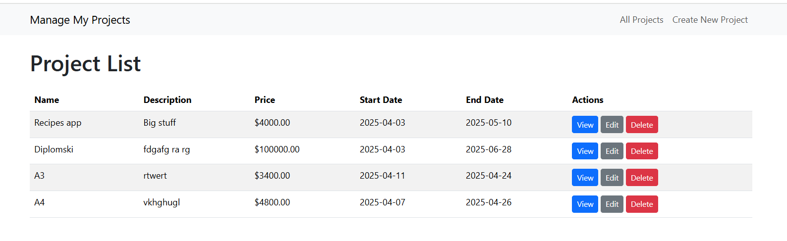
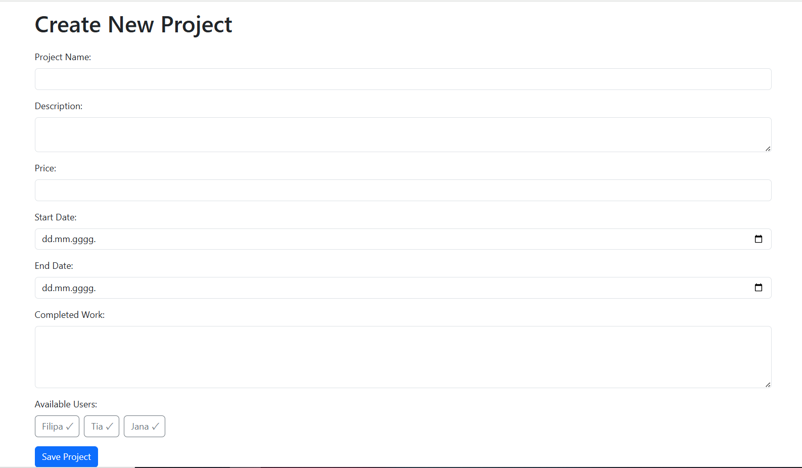
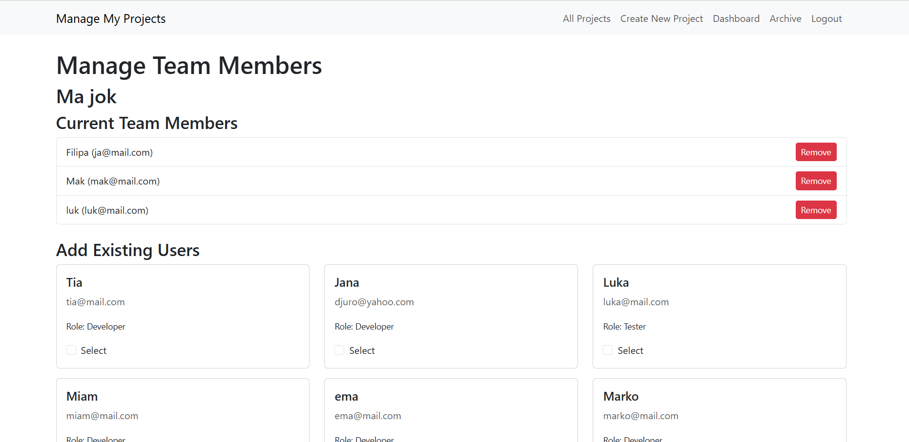

# LV6 i LV7 - Node.js, Express i MongoDB

## Projects Page

    </img>  
    </img> 

## Create New Project

    </img>  

## View Project Details

    </img>  
    </img> 

## My Dashboard

- Managed Projects: All projects that the user has created (he is the project manager).
- Member Projects: All projects where the user is a team member but not the creator.

    </img> 

## Archived Project

    </img>  

## Manage Project Members

    </img>  

## Registration

    </img>  

